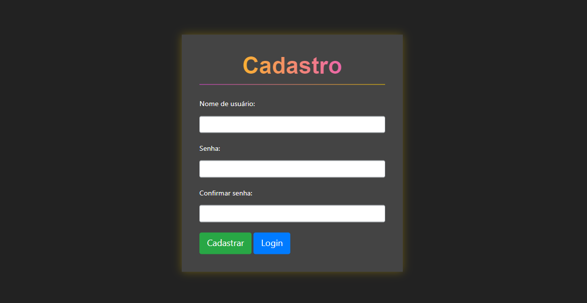

<h1 align="center">
  
</h1>

# Projeto
- Repositório contendo o código da Pystack Week 3.0, oferecido pela [Pythonando][pythonando], desenvolvendo uma aplicação completa do zero com Python e com o framework DJANGO.
- A aplicação desenvolvida tem por finalidade gerenciar freelancers.

## 🛠 Tecnologias

As seguintes tecnologias foram utilizadas no desenvolvimento do projeto:

- [Django][django]

## 📷 Imagens

<kbd>
  
</kbd>

<kbd>
  
</kbd>

<kbd>
  
</kbd>

<kbd>
  
</kbd>

[pythonando]: https://pythonando.com.br/
[django]: https://www.djangoproject.com/
